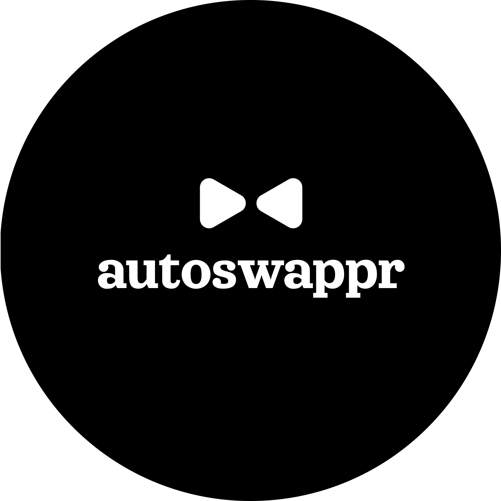

# AutoSwappr

<br>
AutoSwappr is a StarkNet-based decentralized application designed for automated token swapping, offering a one-stop solution to guard against highly volatile non-stable crypto assets. By leveraging the AVNU Exchange, it simplifies the process of auto-swapping non-stable tokens to stable ones through an upgradeable, ownable contract. AutoSwappr streamlines asset management, ensuring secure and seamless token swap processes with minimal manual intervention.

## Features

### Core Functionality

- Automated Token Swapping: Subscription-based system for automated conversion of assets
- Multi-Route Support: Flexible routing options for complex token swaps
- Real-time Event Tracking: Comprehensive event logging for swaps and subscriptions

### Technical Features

- Upgradeable Architecture: OpenZeppelin-based upgradeable contract system
- Secure Fee Management: Configurable fee collection system
- Custom Route Configuration: Support for complex multi-token swap routes

## Architecture

AutoSwappr is built on StarkNet and implements:

    - OpenZeppelin standards for upgradeability
    - AVNU Exchange integration for swap execution
    - Event-driven architecture for transaction tracking

## Getting Started

## Prerequisites

To set up and run the project locally, ensure you have the following installed:

- [**StarkNet Foundry**](https://foundry-rs.github.io/starknet-foundry/index.html)
- [**Scarb**](https://docs.swmansion.com/scarb/download.html)
- [**ASDF Version Manager**](https://asdf-vm.com/guide/getting-started.html)

## Installation

1. **Fork the Repository**

2. **Clone the Repository**

```bash
   git clone https://github.com/BlockheaderWeb3-Community/auto-swap
   cd auto-swap
```

3. **Set Up Development Environment**

   To set up development environment:

```bash
    # Configure Scarb version
    asdf local scarb 2.8.5

    # Configure StarkNet Foundry
   asdf local starknet-foundry 0.31.0
```

4. Build the Project:

```bash
   scarb build
```

## Development

### Building

The project uses Scarb as its build tool. To build the contracts:

```bash
scarb build
```

## Testing

Run the test suite using StarkNet Foundry:

```bash
snforge test
```

## Contributing

We welcom contributions! Please follow these steps:

1. Fork the repository
2. Create your feature branch (git checkout -b feature/AmazingFeature)
3. Commit your changes (git commit -m 'Add some AmazingFeature')
4. Push to the branch (git push origin feature/AmazingFeature)
5. Open a Pull Request

## Coding Standards

- **Cairo Code:** Follow the [Cairo documentation](https://www.cairo-lang.org/docs/) and best practices.
- **ASDF:** Follow the [asdf installation](https://asdf-vm.com/guide/getting-started.html) instructions
- **Testing:** Write tests for your code and ensure all tests pass before submitting a PR.

## Pull Request Process

1. Ensure your branch is up to date with master
2. Include relevant test cases
3. Update documentation as needed
4. Provide a detailed description of changes
5. Request review from maintainers

## Support

For support and queries:

- Open an issue in the GitHub repository
- Join our [Discord Community](https://discord.gg/vdpdbssf)
- Join our [X Community](https://x.com/blockheaderweb3)

---

Built with ❤️ by the BlockheaderWeb3 Community
